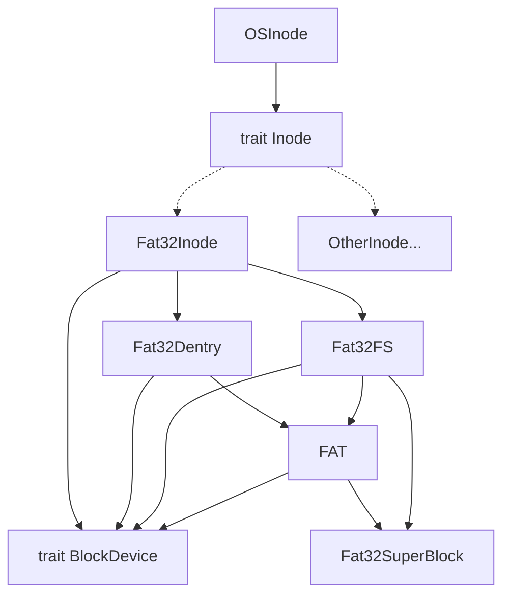

# 初赛文档

[TOC]

## 1.概述

chaos 是一个用 Rust 编写的基于 [2024 春夏季开源操作系统训练营 rCore 项目](https://github.com/bosswnx/2024s-rcore-bosswnx)的 RISC-V 架构的兼容 POSIX 协议的操作系统内核。目前初赛的赛题已满分通过，见下图：


队员全部来自北京科技大学，组员以及分工如下：

- 王诺贤：文件系统设计与 FAT32 支持，部分 syscalls 实现；
- 陈宽宽：进程、内存管理设计，部分 syscall 实现；
- 乐一然：部分 syscalls 实现。

## 2. chaos 设计与实现

### 2.1 进程管理

进程是操作系统中资源管理的基本单位，而线程是操作系统调度的基本单位。在 chaos 中，进程由 `Process` 结构体表示，线程由所属进程统一管理，二者的底层实现都是一个 `Task` 结构体。每个进程拥有独立的内核栈，同一进程下的线程则共享进程内核栈空间。

#### 2.1.1 进程控制块 
```rust
//os/src/task/process.rs

/// Process Control Block
pub struct ProcessControlBlock {
    /// immutable
    pub pid: PidHandle,
    /// mutable
    inner: UPSafeCell<ProcessControlBlockInner>,
}
```
进程被分为可变和不可变两个部分管理。不可变部分仅包含 `PCB` 创建时就被分配的 `pid` ，而对于可变那部分我们封装为 `ProcessControlBlockInner` 由于进程的父进程和其锁管理的线程都需要持有其所有权，我们使用Rust的智能指针 `Arc` 将其包裹以确保异步安全性，而 `Arc` 在Rust中默认不可变，因此我们管理 `ProcessControlBlockInner` 时利用了Rust的内部可变性。我们封装了 `RefCell` ：

```rust
//os/src/sync/up.rs

pub struct UPSafeCell<T> {
    /// inner data
    inner: RefCell<T>,
}

unsafe impl<T> Sync for UPSafeCell<T> {}

impl<T> UPSafeCell<T> {
    /// User is responsible to guarantee that inner struct is only used in
    /// uniprocessor.
    pub unsafe fn new(value: T) -> Self {
        Self {
            inner: RefCell::new(value),
        }
    }
    /// Panic if the data has been borrowed.
    pub fn exclusive_access(&self) -> RefMut<'_, T> {
        self.inner.borrow_mut()
    }
}
```
`RefCell` 是 Rust 标准库中的一个类型，提供了在运行时进行可变借用检查的能力。它允许在单线程环境中进行内部可变性（interior mutability）。`Sync` 是一个标记 `trait`，表示类型可以安全地在多个线程间共享引用。`RefCell` 本身不是 `Sync` 的，因为它只在单线程环境中保证安全，因此我们通过 `unsafe impl` 声明，承诺 `UPSafeCell` 可以安全地在多线程环境中共享。在多核环境下，这种方法并不安全，只是一种在多核尚未实现的情况下的临时措施。

可变部分的内容如下：
```rust
/// Inner of Process Control Block
pub struct ProcessControlBlockInner {
    /// is zombie?
    pub is_zombie: bool,
    /// memory set(address space)
    pub memory_set: MemorySet,
    /// parent process
    pub parent: Option<Weak<ProcessControlBlock>>,
    /// children process
    pub children: Vec<Arc<ProcessControlBlock>>,
    /// exit code
    pub exit_code: i32,
    /// file descriptor table
    pub fd_table: Vec<Option<Arc<dyn File + Send + Sync>>>,
    /// signal flags
    pub signals: SignalFlags,
    /// tasks(also known as threads)
    pub tasks: Vec<Option<Arc<TaskControlBlock>>>,
    /// task resource allocator
    pub task_res_allocator: RecycleAllocator,
    /// mutex list
    pub mutex_list: Vec<Option<Arc<dyn Mutex>>>,
    /// semaphore list
    pub semaphore_list: Vec<Option<Arc<Semaphore>>>,
    /// condvar list
    pub condvar_list: Vec<Option<Arc<Condvar>>>,
    /// clock time stop watch
    pub clock_stop_watch: usize,
    /// user clock time
    pub user_clock: usize,
    /// kernel clock time
    pub kernel_clock: usize,
    /// Record the base of heap_area in MemorySet
    pub heap_base: VirtAddr,
    /// Record the usage of heap_area in MemorySet
    pub heap_end: VirtAddr,
    /// working directory
    pub work_dir: Arc<OSInode>,
}
```
每个成员的作用如注释所述。我们通过对子进程持强引用，对父进程持弱引用来防止循环引用造成的内存泄漏。

#### 2.1.2 线程控制块
```rust
/// Task control block structure
pub struct TaskControlBlock {
    /// immutable
    pub process: Weak<ProcessControlBlock>,
    /// Kernel stack corresponding to PID
    pub kstack: KernelStack,
    /// mutable
    inner: UPSafeCell<TaskControlBlockInner>,
}
```
和 `PCB` 的处理类似，我们也将 `TCB` 分为可变部分和不可变部分处理。这里不可变的部分是线程所属的父进程以及创建时就分配的内核栈位置，可变部分同样使用 `UPSafeCell` 管理。这里的实现是可以确保安全的，因为我们的OS仍是单核实现，且在我们的OS中， `Task` 作为程序执行的最小单位，也就是在多核环境下，一个 `Task` 只会在一个核心中执行。

可变部分的成员如下：
```rust
pub struct TaskControlBlockInner {
    /// Resources of a task
    pub res: Option<TaskUserRes>,
    /// The physical page number of the frame where the trap context is placed
    pub trap_cx_ppn: PhysPageNum,
    /// Save task context
    pub task_cx: TaskContext,
    /// Maintain the execution status of the current process
    pub task_status: TaskStatus,
    /// It is set when active exit or execution error occurs
    pub exit_code: Option<i32>,
    /// syscall times of tasks
    pub syscall_times: [u32; MAX_SYSCALL_NUM],
    /// the time task was first run
    pub first_time: Option<usize>,
    /// priority
    pub priority: usize,
    /// stride
    pub stride: usize,
    /// pass
    pub pass: usize,
    /// working directory
    pub work_dir: Arc<OSInode>,
}
```
成员的作用如注释所述。我们使用了 `res` 来统一管理线程持有的内存资源，便于我们统一的分配和释放。`priority`、`stride`和`pass`的作用是实现线程调度算法，下文会提到。

#### 2.1.3 线程调度

chaos 采用了 stride 调度算法，算法描述如下:

1. 为每个进程设置一个当前 stride，表示该进程当前已经运行的“长度”。另外设置其对应的 pass 值（只与进程的优先权有关系），表示对应进程在调度后，stride 需要进行的累加值。

2. 每次需要调度时，从当前 runnable 态的进程中选择 stride 最小的进程调度。对于获得调度的进程 P，将对应的 stride 加上其对应的步长 pass。

3. 一个时间片后，回到上一步骤，重新调度当前 stride 最小的进程。

可以证明，如果令 P.pass = BigStride / P.priority 其中 P.priority 表示进程的优先权（大于 1），而 BigStride 表示一个预先定义的大常数，则该调度方案为每个进程分配的时间将与其优先级成正比。

#### 2.1.4 异常与中断

chaos 支持响应来自内核态的中断，我们在进入中断时，将中断入口设置为内核中断处理函数的入口，这样就保证可以正确的处理内核态中断。
```rust
/// set trap entry for traps happen in kernel(supervisor) mode
fn set_kernel_trap_entry() {
    extern "C" {
        fn __trap_from_kernel();
    }
    unsafe {
        stvec::write(__trap_from_kernel as usize, TrapMode::Direct);
    }
}
//
```
其余的中断实现较为常规，这里不做赘述，我们也计划支持浮点数应用的运行，只需要开启浮点数支持，并在中断处理函数中额外保存与恢复浮点数寄存器即可，初赛阶段尚未完成。


### 2.2 内存管理

chaos 暂时沿用了 rCore 的双地址空间机制，即内核与用户拥有两套地址空间。这样的做法虽然可以实现防范侧信道攻击，但是具体实现较为繁琐，用户与内核的互相切换需要通过一个跳板 `TRAMPOLINE` 实现，处理较为复杂。我们计划对其进行重构，取消双地址空间设计，将内核地址直接映射到物理内存高地址处。

#### 2.2.1 地址空间

chaos 使用 sv39 分页机制，拥有足够大的内存供内核与用户使用，因此我们直接指定了一个 `MMAP_BASE`（0x20000000）和 `STACK_TOP`（0x100000000）分别作为 mmap 的基地址和用户栈顶，将用户堆基地址固定放在应用程序 elf 文件末尾，并设置了一页的保护页
```rust
let max_end_va: VirtAddr = max_end_vpn.into();
let mut user_heap_base: usize = max_end_va.into();
user_heap_base += PAGE_SIZE;
```

#### 2.2.2 内存映射

在 chaos 中，内核与用户拥有各自的地址空间。内核的内存被恒等映射到了物理地址高处，而用户地址空间则是基于从elf文件中读取的数据进行物理页帧随机映射。在内核与用户相互切换时，需要用到一个跳板 `TRAMPOLINE` 页面，它被固定恒等映射到物理地址最高位处，且对于所有地址空间地址都相同，因此我们可以通过它来实现内核地址空间和用户地址空间之间的平滑切换。

```linkerscript
    . = BASE_ADDRESS;
    skernel = .;
    stext = .;
    .text : {
        *(.text.entry)
        . = ALIGN(4K);
        strampoline = .;
        *(.text.trampoline);
        . = ALIGN(4K);
        *(.text .text.*)
    }
```

关于物理页帧随机映射，我们使用了一个物理页帧分配器以管理所有物理页帧。对于单个物理页帧，我们遵循了 RAII 思想，这种思想也被广泛运用在我们内核的实现中。我们将一个物理页帧的生命周期绑定到一个 `FrameTracker` 变量上，当一个 `FrameTracker` 被创建的时候，我们需要从 `FRAME_ALLOCATOR` 中分配一个物理页帧：

```rust
pub struct FrameTracker {
    pub ppn: PhysPageNum,
}

impl FrameTracker {
    pub fn new(ppn: PhysPageNum) -> Self {
        // page cleaning
        let bytes_array = ppn.get_bytes_array();
        for i in bytes_array {
            *i = 0;
        }
        Self { ppn }
    }
}
```
当一个 `FrameTracker` 生命周期结束被编译器回收的时候，我们需要将它控制的物理页帧回收到 `FRAME_ALLOCATOR` 中
```rust
impl Drop for FrameTracker {
    fn drop(&mut self) {
        frame_dealloc(self.ppn);
    }
}
```

#### 2.2.3 内存管理相关数据结构

```rust
/// address space
pub struct MemorySet {
    /// page table
    pub page_table: PageTable,
    /// areas
    pub areas: Vec<MapArea>,
    /// heap
    heap_area: BTreeMap<VirtPageNum, FrameTracker>,
    // The memory area formed by mmap does not need to be modified
    // we can use MapArea in Vec to hold FramTracker
    // we set a fixed address as the start address for mmap_area
    // the virtual memorySet is big enough to use it that doesnt concern address conflicts
    pub mmap_area: BTreeMap<VirtPageNum, FrameTracker>,
    // mmap_base will never change
    pub mmap_base: VirtAddr,
    // always aligh to PAGE_SIZE
    pub mmap_end: VirtAddr,
}
```
对于堆空间与 mmap 区域我们采用 `BTreeMap` 进行管理，使用B树管理内存段的索引便于快速的根据给定的虚拟地址进行查找或修改。

### 2.3 文件系统

chaos 文件系统的设计目标是最大程度将文件系统与内核解耦合，从而降低内核代码的复杂性，也能更方便地为 chaos 增加新的文件系统支持。目前 chaos 已经实现了解耦合的基础目标，并且支持了 FAT32 文件系统。

chaos 文件系统架构图：



#### 2.3.1 虚拟文件系统

为了将文件系统和内核解耦合，我们参考了 Linux「一切皆文件」的设计思想，并且利用 Rust 的 trait 提供的抽象的特性，将 inode 抽象为 `trait Inode`，任何实现了该 trait 的对象都可以被视为一个受到支持的文件系统。这样的设计可以抹平不同文件系统的差异.对于内核而言，只需要调用 trait 中定义的方法，就可以对文件系统进行操作。

`trait Inode` 的具体定义如下：

```rust
// os/src/fs/inode.rs

pub trait Inode: Send + Sync {
    /// get status of file
    fn fstat(self: Arc<Self>) -> Stat;
    /// find the disk inode of the file with 'name'
    fn find(self: Arc<Self>, name: &str) -> Option<Arc<dyn Inode>>;
    /// create a file with 'name' in the root directory
    fn create(self: Arc<Self>, name: &str, stat: StatMode) -> Option<Arc<dyn Inode>>;
    /// create a link with a disk inode under current inode
    fn link(self: Arc<Self>, old_name: &str, new_name: &str) -> Option<Arc<dyn Inode>>;
    /// Remove a link under current inode
    fn unlink(self: Arc<Self>, name: &str) -> bool;
    /// list the file names in the root directory
    fn ls(self: Arc<Self>) -> Vec<String>;
    /// Read the content in offset position of the file into 'buf'
    fn read_at(self: Arc<Self>, offset: usize, buf: &mut [u8]) -> usize;
    /// Write the content in 'buf' into offset position of the file
    fn write_at(self: Arc<Self>, offset: usize, buf: &[u8]) -> usize;
    /// Set the file(disk inode) length to zero, delloc all data blocks of the file.
    fn clear(self: Arc<Self>);
    /// Get the current directory name
    fn current_dirname(self: Arc<Self>) -> Option<String>;
}
```

内核实际内存中的 inode 是 `OSInode` 类型，其内部有一个 `Arc<dyn Inode>` 指向实际文件系统的 inode：

```rust
// os/src/fs/inode.rs

/// inode in memory
pub struct OSInode {
    readable: bool,
    writable: bool,
    inner: UPSafeCell<OSInodeInner>,
}

/// inner of inode in memory
pub struct OSInodeInner {
    pos: usize,
    name: String,
    inode: Arc<dyn Inode>,
}
```

`OSInodeInner` 由 `UPSafeCell` 包裹起来，目的有两个：

- 保证同时只有一个线程能获取对象的写权限，防止多线程出现数据竞争。
- 通过将可变对象和不可变对象分开，使得我们可以在访问可变对象的同时，只对 inner 上锁，让外部的不可变对象的访问可以并行执行，极大的提高了访问的并行性。

`inner` 中除了有 `inode` 以外，还有文件指针 `pos` 和当前目录项名称 `name`。

对于一个 `OSInode` 对象，我们通过调用其内部 `inode` 的 `trait Inode` 的对应方法，并将得到的 `Arc<dyn Inode>` 对象重新封装成 `OSInode` 类型返回，来获得一个新的 `OSInode`。对应的代码在 `os/src/fs/inode.rs` 中。

通过以上方法，chaos 可以不需要知道具体的文件系统类型，达到内核与文件系统解耦合的目标。

#### 2.3.2 FAT32 文件系统

chaos 支持 FAT32 文件系统，能够实现读、写、创建目录项、删除目录项等基础操作。

FAT32 文件系统并没有 inode 的概念，取而代之的是「簇」。一个簇的大小为四个扇区，每个扇区的大小是 512B，则一个簇的大小为 4KB。FAT32 将硬盘从前往后按簇进行划分，并从 0 开始标号。

簇的概念与 inode 相似，因此我们可以用 inode 来表示 FAT32 中簇的概念，创建出 `Fat32Inode` 类型，并将其实现 `trait Inode`：

```rust
// os/src/fs/fat32/inode.rs

#[derive(Clone)]
pub struct Fat32Inode {
    pub type_: Fat32InodeType,
    pub dentry: Arc<Mutex<Fat32Dentry>>,
    pub start_cluster: usize,
    pub fs: Arc<Mutex<Fat32FS>>,
    pub bdev: Arc<dyn BlockDevice>,
}

impl Inode for Fat32Inode {
    // 具体的实现方法在这里略过
}
```

下面对 `Fat32Inode` 的成员变量进行解释：

- `type_`：该文件的类型，例如文件、目录、盘符等。
- `dentry`： 该文件/目录的对应目录项。通过记录目录项所在的簇号和偏移量实现。
- `start_cluster` ：该文件/目录的起始簇号。
- `fs`：提供了操作该 FAT32 文件系统的一些方法。FAT 表对象也是存放在其中。
- `bdev`：该文件系统所在的块设备。用于对块设备进行读取/写入操作。

`Fat32FS` 类型包含了超级快、FAT 表，以及提供了一系列与 FAT32 有关的方法：

```rust
// os/src/fs/fat32/file_system.rs
pub struct Fat32FS {
    pub sb: Fat32SB,
    pub fat: Arc<FAT>,
    pub bdev: Arc<dyn BlockDevice>,
}

impl Fat32FS {
    /// load a exist fat32 file system from block device
    pub fn load(bdev: Arc<dyn BlockDevice>) -> Arc<Mutex<Self>>;
    /// get root inode
    pub fn root_inode(fs: &Arc<Mutex<Fat32FS>>) -> Fat32Inode;
    /// get cluster chain
    pub fn cluster_chain(&self, start_cluster: usize) -> Vec<usize>;
    /// read a cluster
    pub fn read_cluster(&self, cluster: usize, buf: &mut [u8; 4096]);
    /// write a cluster
    pub fn write_cluster(&self, cluster: usize, buf: &[u8; 4096]);
    /// get next dentry sector id and offset
    pub fn next_dentry_id(&self, sector_id: usize, offset: usize) -> Option<(usize, usize)>;
    /// get a dentry with sector id and offset
    pub fn get_dentry(&self, sector_id: &mut usize, offset: &mut usize) -> Option<Fat32Dentry>;
    /// remove a dentry
    pub fn remove_dentry(&self, dentry: &Fat32Dentry);
}
```

除了 `Fat32Inode` 和 `Fat32FS` 以外，`FAT`、`Fat32Dentry` 和 `Fat32SB` 也实现了一些方法，用于获取其内部的信息。在此不过多展开。

通过以上类型组合，最终形成了 `fat32` 模块。最后只需将 `Fat32Inode` 暴露给内核，就实现了对 FAT32 文件系统的支持。

## 3. 总结与展望

chaos 项目从初始化仓库到完成初赛的所有赛题，仅仅花费了一周的时间。在这七天里，我们实现了众多的 syscalls、文件系统的重构、 FAT32 的支持……这些成就，离不开队员们良好的沟通、相互的信任和夜以继日的努力。

在 chaos 的开发过程中，我们参考了许多优秀的开源项目，例如 [Linux](https://github.com/torvalds/linux)、[Titanix](https://github.com/greenhandzpx/Titanixhttps://gitlab.eduxiji.net/202318123101314/oskernel2023-Titanix)、[Main.os(2)(1)(1)](https://gitlab.eduxiji.net/202310008101520/oskernel2023-x) 等。不过，我们仅参考了这些项目的优秀思想，代码均是自己实现。

如此短的开发时间，注定了 chaos 会存在许多潜在的问题以及一些功能的缺失。在未来的时间里，我们会逐步将 chaos 进行重构，朝着更为完整的操作系统内核前进。

未来计划：

- 整理、重构代码，解耦合；
- 实现无栈协程；
- 实现多核支持；
- 适配更多的文件系统，例如 dev、proc 等；
- 移植 busybox 和 libc；
- 增加网卡驱动和网络栈，实现网络功能；
- ……
  