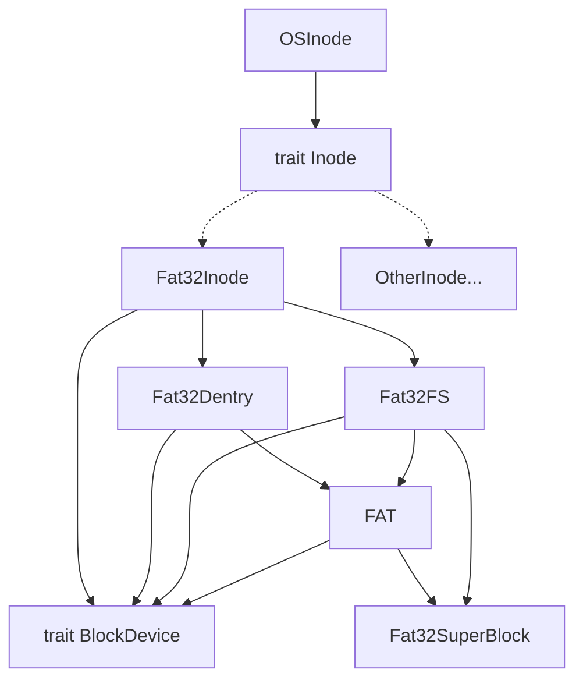

目录：

1. 概述
   1. chaos 介绍
   2. 目录和文件描述
2. chaos 设计与实现
   1. 进程管理
      1. 概述
      2. 进程控制快
      3. 线程控制块
      4. 线程调度
      5. 异常与中断
   2. 内存管理
      1. 概述
      2. 地址空间
      3. 内存映射
      4. 内存管理相关数据结构
      5. 用户地址检查
   3. 文件系统
      1. 概述
      2. 虚拟文件系统
      3. FAT32 文件系统
3. 总结与展望
   1. 工作总结
   2. 未来计划

## 1.概述

chaos 是一个用 Rust 编写的基于 rCore 的 RISC-V 架构的兼容 POSIX 协议的操作系统内核。目前初赛的赛题已满分通过，见下图：

## 2. chaos 设计与实现

### 2.3 文件系统

#### 2.3.1 概述

chaos 文件系统的设计目标是最大程度将文件系统与内核解耦合，从而降低内核代码的复杂性，也能更方便地为 chaos 增加新的文件系统支持。目前 chaos 已经实现了解耦合的基础目标，并且支持了 FAT32 文件系统。

chaos 文件系统架构图：



#### 2.3.2 虚拟文件系统

为了将文件系统和内核解耦合，我们参考了 Linux「一切皆文件」的设计思想，并且利用 Rust 的 trait 提供的抽象的特性，将 inode 抽象为 `trait Inode`，任何实现了该 trait 的对象都可以被视为一个受到支持的文件系统。这样的设计可以抹平不同文件系统的差异.对于内核而言，只需要调用 trait 中定义的方法，就可以对文件系统进行操作。

`trait Inode` 的具体定义如下：

```rust
// os/src/fs/inode.rs

pub trait Inode: Send + Sync {
    /// get status of file
    fn fstat(self: Arc<Self>) -> Stat;
    /// find the disk inode of the file with 'name'
    fn find(self: Arc<Self>, name: &str) -> Option<Arc<dyn Inode>>;
    /// create a file with 'name' in the root directory
    fn create(self: Arc<Self>, name: &str, stat: StatMode) -> Option<Arc<dyn Inode>>;
    /// create a link with a disk inode under current inode
    fn link(self: Arc<Self>, old_name: &str, new_name: &str) -> Option<Arc<dyn Inode>>;
    /// Remove a link under current inode
    fn unlink(self: Arc<Self>, name: &str) -> bool;
    /// list the file names in the root directory
    fn ls(self: Arc<Self>) -> Vec<String>;
    /// Read the content in offset position of the file into 'buf'
    fn read_at(self: Arc<Self>, offset: usize, buf: &mut [u8]) -> usize;
    /// Write the content in 'buf' into offset position of the file
    fn write_at(self: Arc<Self>, offset: usize, buf: &[u8]) -> usize;
    /// Set the file(disk inode) length to zero, delloc all data blocks of the file.
    fn clear(self: Arc<Self>);
    /// Get the current directory name
    fn current_dirname(self: Arc<Self>) -> Option<String>;
}
```

内核实际内存中的 inode 是 `OSInode` 类型，其内部有一个 `Arc<dyn Inode>` 指向实际文件系统的 inode：

```rust
// os/src/fs/inode.rs

/// inode in memory
pub struct OSInode {
    readable: bool,
    writable: bool,
    inner: UPSafeCell<OSInodeInner>,
}

/// inner of inode in memory
pub struct OSInodeInner {
    pos: usize,
    name: String,
    inode: Arc<dyn Inode>,
}
```

`OSInodeInner` 由 `UPSafeCell` 包裹起来，目的有两个：

- 保证同时只有一个线程能获取对象的写权限，防止多线程出现数据竞争。
- 通过将可变对象和不可变对象分开，使得我们可以在访问可变对象的同时，只对 inner 上锁，让外部的不可变对象的访问可以并行执行，极大的提高了访问的并行性。

`inner` 中除了有 `inode` 以外，还有文件指针 `pos` 和当前目录项名称 `name`。

对于一个 `OSInode` 对象，我们通过调用其内部 `inode` 的 `trait Inode` 的对应方法，并将得到的 `Arc<dyn Inode>` 对象重新封装成 `OSInode` 类型返回，来获得一个新的 `OSInode`。对应的代码在 `os/src/fs/inode.rs` 中。

通过以上方法，chaos 可以不需要知道具体的文件系统类型，达到内核与文件系统解耦合的目标。

#### 2.3.3 FAT32 文件系统

chaos 支持 FAT32 文件系统，能够实现读、写、创建目录项、删除目录项等基础操作。

FAT32 文件系统并没有 inode 的概念，取而代之的是「簇」。一个簇的大小为四个扇区，每个扇区的大小是 512B，则一个簇的大小为 4KB。FAT32 将硬盘从前往后按簇进行划分，并从 0 开始标号。

簇的概念与 inode 相似，因此我们可以用 inode 来表示 FAT32 中簇的概念，创建出 `Fat32Inode` 类型，并将其实现 `trait Inode`：

```rust
// os/src/fs/fat32/inode.rs

#[derive(Clone)]
pub struct Fat32Inode {
    pub type_: Fat32InodeType,
    pub dentry: Arc<Mutex<Fat32Dentry>>,
    pub start_cluster: usize,
    pub fs: Arc<Mutex<Fat32FS>>,
    pub bdev: Arc<dyn BlockDevice>,
}

impl Inode for Fat32Inode {
    // 具体的实现方法在这里略过
}
```

下面对 `Fat32Inode` 的成员变量进行解释：

- `type_`：该文件的类型，例如文件、目录、盘符等。
- `dentry`： 该文件/目录的对应目录项。通过记录目录项所在的簇号和偏移量实现。
- `start_cluster` ：该文件/目录的起始簇号。
- `fs`：提供了操作该 FAT32 文件系统的一些方法。FAT 表对象也是存放在其中。
- `bdev`：该文件系统所在的块设备。用于对块设备进行读取/写入操作。

`Fat32FS` 类型包含了超级快、FAT 表，以及提供了一系列与 FAT32 有关的方法：

```rust
// os/src/fs/fat32/file_system.rs
pub struct Fat32FS {
    pub sb: Fat32SB,
    pub fat: Arc<FAT>,
    pub bdev: Arc<dyn BlockDevice>,
}

impl Fat32FS {
    /// load a exist fat32 file system from block device
    pub fn load(bdev: Arc<dyn BlockDevice>) -> Arc<Mutex<Self>>;
    /// get root inode
    pub fn root_inode(fs: &Arc<Mutex<Fat32FS>>) -> Fat32Inode;
    /// get cluster chain
    pub fn cluster_chain(&self, start_cluster: usize) -> Vec<usize>;
    /// read a cluster
    pub fn read_cluster(&self, cluster: usize, buf: &mut [u8; 4096]);
    /// write a cluster
    pub fn write_cluster(&self, cluster: usize, buf: &[u8; 4096]);
    /// get next dentry sector id and offset
    pub fn next_dentry_id(&self, sector_id: usize, offset: usize) -> Option<(usize, usize)>;
    /// get a dentry with sector id and offset
    pub fn get_dentry(&self, sector_id: &mut usize, offset: &mut usize) -> Option<Fat32Dentry>;
    /// remove a dentry
    pub fn remove_dentry(&self, dentry: &Fat32Dentry);
}
```

除了 `Fat32Inode` 和 `Fat32FS` 以外，`FAT`、`Fat32Dentry` 和 `Fat32SB` 也实现了一些方法，用于获取其内部的信息。在此不过多展开。

通过以上类型组合，最终形成了 `fat32` 模块。最后只需将 `Fat32Inode` 暴露给内核，就实现了对 FAT32 文件系统的支持。

## 3. 总结与展望

chaos 项目从初始化仓库到完成初赛的所有赛题，仅仅花费了一周的时间。在这七天里，我们实现了众多的 syscalls、文件系统的重构、 FAT32 的支持……这些成就，离不开队员们良好的沟通、相互的信任和夜以继日的努力。

在 chaos 的开发过程中，我们参考了许多优秀的开源项目，例如 Linux、Titanix、Main.os(2)(1)(1) 等。不过，我们仅参考了这些项目的优秀思想，代码均是自己实现。

如此短的开发时间，注定了 chaos 会存在许多潜在的问题以及一些功能的缺失。在未来的时间里，我们会逐步将 chaos 进行重构，朝着更为完整的

未来计划：

- 整理、重构代码，解耦合；
- 实现无栈协程；
- 实现多核支持；
- 适配更多的文件系统，例如 dev、proc 等；
- 移植 busybox 和 libc；
- 增加网卡驱动和网络栈，实现网络功能；
- ……
  