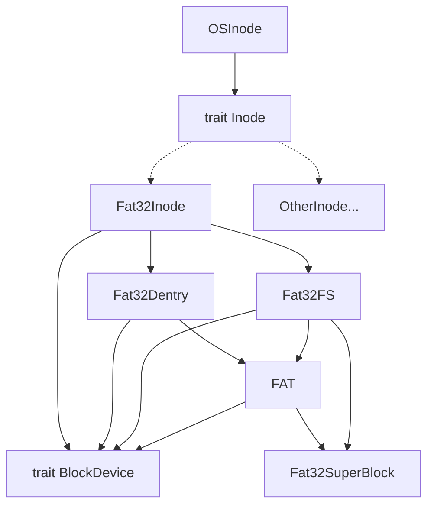

# 文件系统

为了更方便地支持更多的文件系统，以及为了将文件系统与内核解耦合，chaos 利用 rust 的 trait 特性，将内核所需要的文件系统提供的功能抽象成 `trait Inode`，位于 `os/src/fs/inode.rs`。任何实现了该 trait 的类型都可以被视为一个受支持的文件系统。

目前 chaos 的 `trait Inode` 有以下接口：

- `fstat`：获取当前 inode 的状态
- `find`：在当前目录中查找名为 `name` 的目录项
- `create`：在当前目录中创建一个名为 `name` 的目录项
- `link`：在当前目录创建一个名为 `new_name` 的目录项指向 `old_name`
- `unlink`：删除一个名为 `name` 的目录项
- `ls`：列出当前目录下的所有目录项
- `read_at`：读取当前文件的数据
- `write_at`：向当前文件写入数据
- `clear`：清空当前文件的所有数据
- `current_dirname`：当前目录的名字

chaos 实际的 inode 都是 `OSInode` 类型，其内部有一个 `Arc<dyn Inode>` 指针指向实际的 inode，chaos 通过调用 trait 对应的方法来实现对不同文件系统进行统一的调用。这样的设计可以抹平不同文件系统之间的差异，将文件系统和内核解耦合。

chaos 目前实现了基础的 FAT32 文件系统的支持，对应模块位于 `os/src/fs/fat32` 下。

## 架构图

## 改进

- chaos 目前的文件系统架构其实对于多文件系统的支持不是很好，无法做到将一个文件系统 mount 到另一个文件系统上。改进目标参考 Linux 的 vfs 设计。
- 支持更多的文件系统，例如 dev、proc 等
