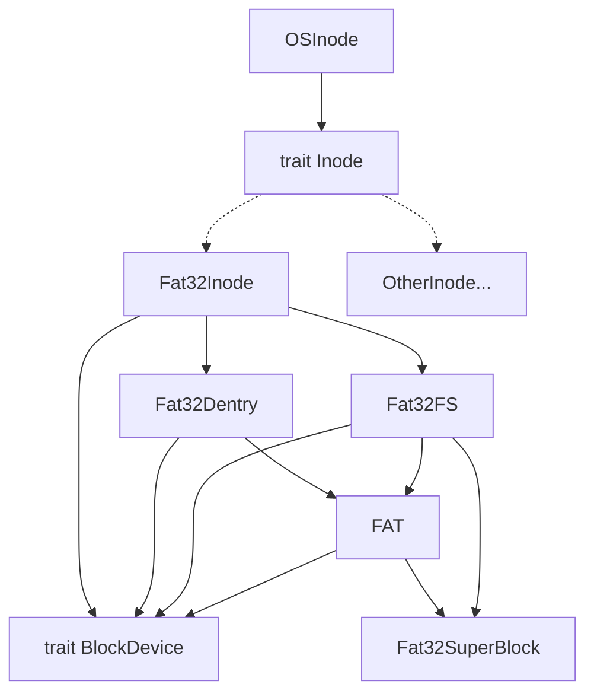

# 文件系统

为了更方便地支持更多的文件系统，以及为了将文件系统与内核解耦合，chaos 利用 rust 的 trait 特性，将内核所需要的文件系统提供的功能抽象成 `trait Inode`。任何实现了该 trait 的类型都可以被视为一个受支持的文件系统。

chaos 目前实现了基础的 FAT32 文件系统的支持，对应模块位于 `os/fs/fat32` 下。

## 架构图

## 改进

chaos 目前的文件系统架构其实对于多文件系统的支持不是很好，无法做到将一个文件系统 mount 到另一个文件系统上。

改进目标参考 Linux 的 vfs 设计。