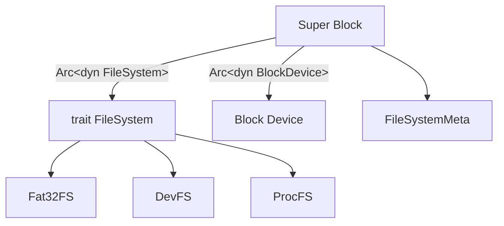

## 文件系统挂载流程

所有的磁盘相关操作都需要经过 `block_cache`，这样才能保证同步。

## Fat32 BPB 结构

注意：标注 * 号表示无用。

|标识|长度|介绍|值|
|---|---|---|---|
|BytesPerSec|2字节|每扇区字节数,通常为512、1024、2048、4096|0x00 0x02|
|SecPerClus|1字节|每簇扇区数,这个值不能为0，而且必须是2的整数次方，比如1、2、4、8、16、32、64、128|0x08|
|ResdSecCnt|2字节|保留扇区数|0x5E 0x06|
|NumFATs|1字节|FAT表数目|0x02|
|*RootEntCnt|2字节|FAT32固定为0|0x00 0x00|
|*TotSec16|2字节|FAT32固定为0|0x00 0x00|
|*Media|1字节|存储介质,0xF8标准值，可移动存储介质|0xf8|
|*FATSz16|2字节|FAT32固定为0|0x00 0x00|
|*SecPerTrk|2字节|磁道扇区数|0x3f 0x00|
|*NumHeads|2字节|磁头数|0xff 0x00|
|*HiddSec|4字节|FAT区前隐藏扇区数|0x00 0x08 0x00 0x00|
|TotSec32|4字节|总扇区数|0x00 0xC0 0xF3 0x00|
|FATSz32|4字节|一个FAT表扇区数|0xd1 0x3c 0x00 0x00|
|*ExtFlags|2字节|FAT32持有|0x00 0x00|
|*FSVer|2字节|FAT32持有|0x00 0x00|
|RootClus|4字节|第一个目录的簇号|0x02 0x00 0x00 0x00|
|*FSInfo|2字节|保留扇区数,FSINFO（文件系统信息扇区）扇区号是1，该扇区为操作系统提供关于空簇总数及下一可用簇的信息|0x01 0x00|
|*BkBootSec|2字节|通常为6|0x06 0x00|
|*Reserved|12字节|用以扩展|0x00 0x00 … 0x00|
|*DrvNum|1字节|驱动器号|0x80|
|*Reserved1|1字节|保留|0x00|
|*BootSig|1字节|扩展引导标签|0x29|
|*VolID|4字节|分区序列|0x24 0x09 0x88 0x8a|
|*FileSysType|11字节|卷标|略|
|*FilSysType1|8字节|系统ID|略|

## 文件系统架构图
