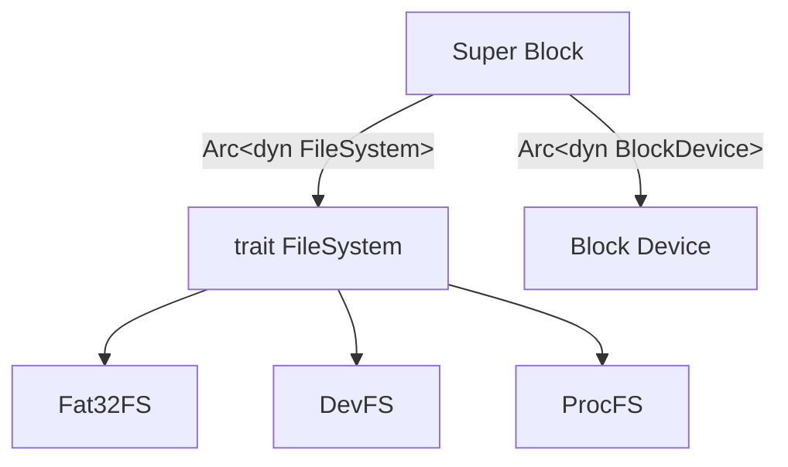

```mermaid

graph TB;

fs[trait FileSystem];
sb[Super Block];
bdev[Block Device]
fat32fs[Fat32FS];
devfs[DevFS];
procfs[ProcFS];

fs --> fat32fs;
fs --> devfs;
fs --> procfs;
sb -->|Arc&lt;dyn FileSystem&gt;| fs;
sb -->|Arc&lt;dyn BlockDevice&gt;| bdev;


```